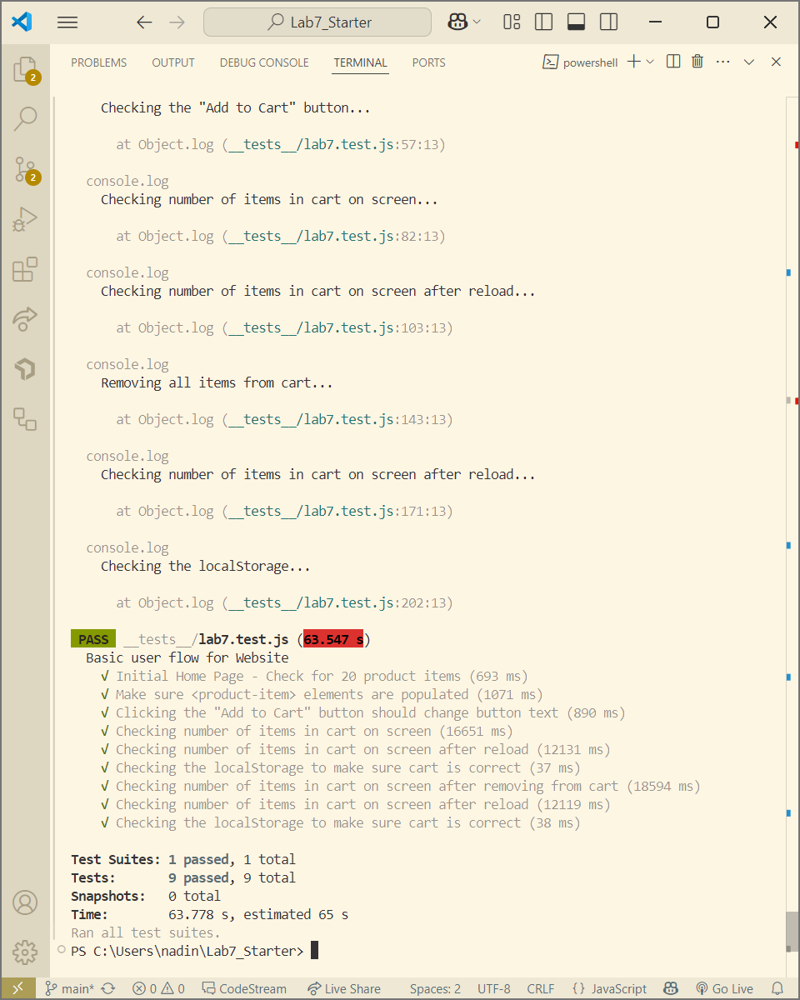

Nadine Apresto

1. Automated tests in my Recipe project development pipeline would fit within a Github Action that runs whenever code is pushed. This is to ensure that tests are consistently and automatically executed on every push. This allows us to catch bugs and errors early and prevent broken code from being merged onto the main branch without any checks.

2. No, we would not use E2E testing for checking if a function is returning the correct output. That would be more of a unit testing issue since it concerns function logic. E2E testing is for trying to simulate real user interactions with the full application.

3. Navigation mode analyzes the website right after it fully loads, simulating a real user visiting and utilizing the page. Meanwhile, Snapshot mode captures the current page state wihtout simulating a page load. Snapshot mode doesn't measure perfomance metrics like page load performance which Navigation mode does.

4. Based on the diagnostics of the page load, to improve the site we can first add a `<meta name="viewport">` tag which can optimize the app for mobile devices. We can also properly size images because it reports potential savings of 718 KiB which would speed up page load significantly. We can also preload the largest contentful image to improve loading speeds up to 30ms.

npm test resutlts:

